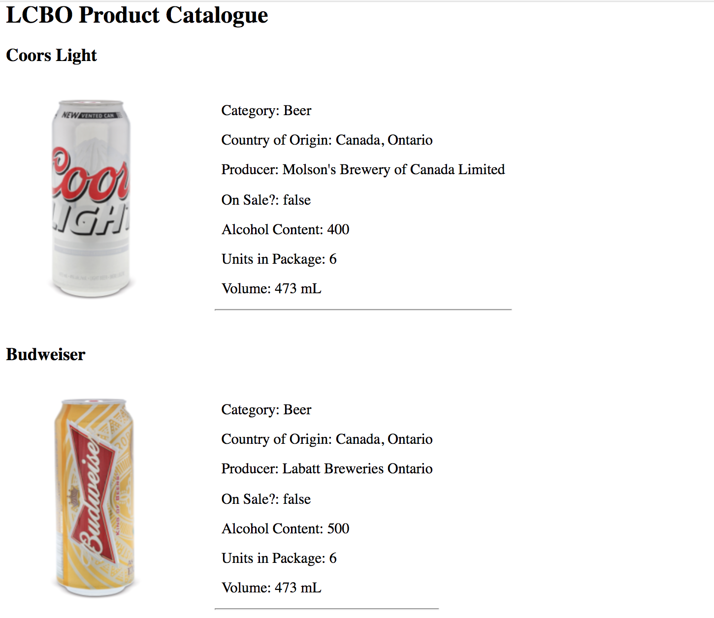

# LCBO Product Catalogue API

This Rails 5.1.4 app runs the unofficial LCBO API; localhost:3000

**/products** gives the index list of LCBO products available on the API, in addition to a small image and list of details regarding each product. As of 03/09/17, this list has some additional CSS layout formatting.

**/inventories** experiments with calling a cross-referenced (from product and store endpoints) subsection of data from the API.

